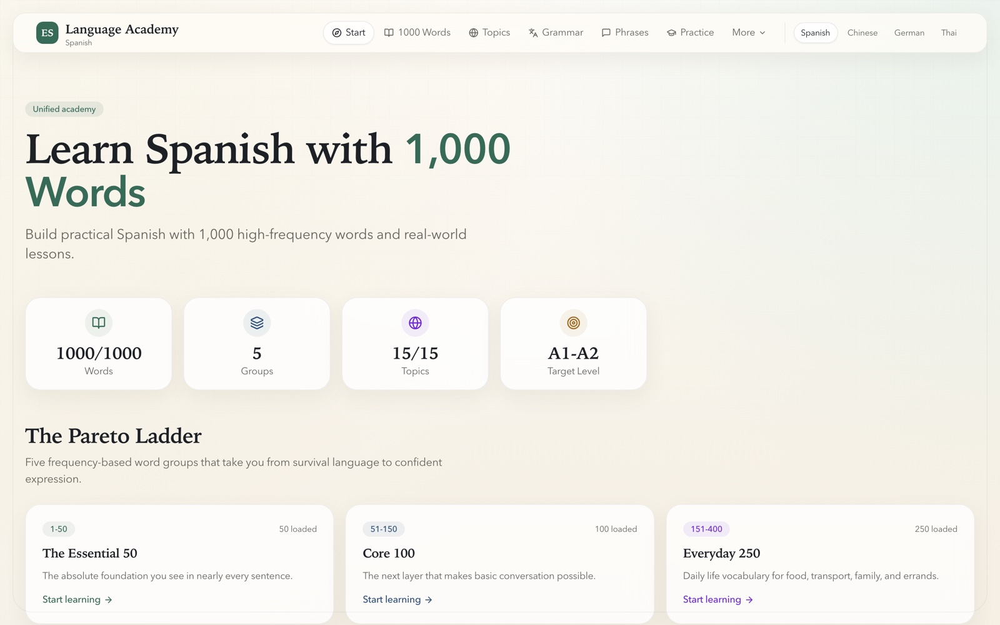
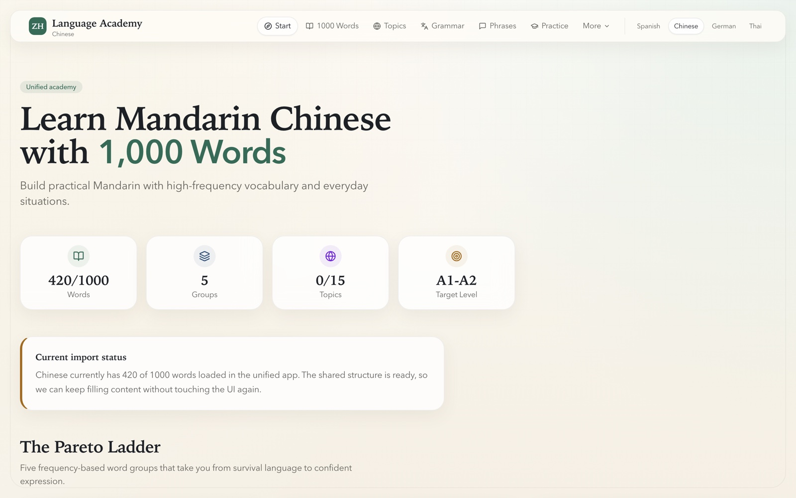
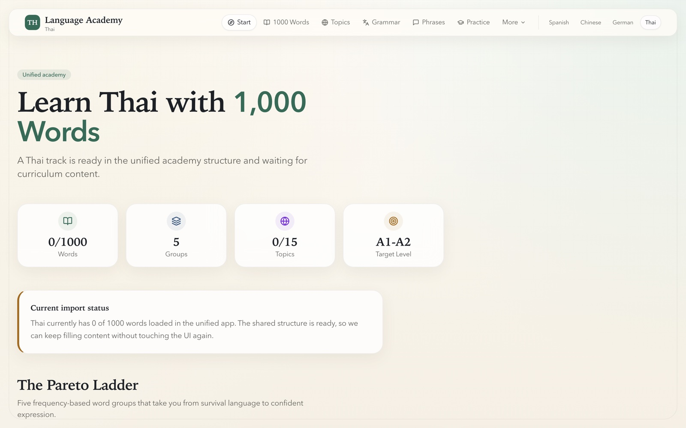

# 🗣️ Language Academy

> Four language tracks, one shared shell. Vocabulary ranked by real-world frequency, so the first
> fifty words you learn are the fifty that actually carry a conversation. **No account, no backend,
> nothing phoning home.**

**[▶ Open the live app](https://vdapp41-spanish-academy.vercel.app)** - pick a language and start reading. Nothing to sign up for.

```bash
git clone https://github.com/BrysonW24/vdapp34-language-academy.git
cd vdapp34-language-academy
npm install && npm run dev
```

Open <http://localhost:3000>. 🎉

<p align="center">
  
</p>

---

## 🎯 The idea: frequency first

Vocabulary apps usually teach you words in the order a textbook chapter needs them. This one orders
them by **how often you will actually meet them**, and it commits to that hard enough to build the
whole navigation around it.

Every word carries a **contiguous frequency rank** - Spanish runs 1 to 1000 with no gaps and no
duplicates, German 1 to 700, Chinese 1 to 420 - and words are grouped into a five-tier ladder:

| Tier | Range | The promise |
|---|---|---|
| **The Essential 50** | 1-50 | The words you cannot hold a sentence together without |
| **Core 100** | 51-150 | Enough to be understood, badly |
| **Everyday 250** | 151-400 | Ordinary daily situations |
| **Confident 350** | 401-750 | You stop translating in your head |
| **Fluent 250** | 751-1000 | Nuance, register, opinion |

<p align="center">
  
  
</p>

Each word card shows rank, the term (with its article for German), English, pronunciation, a
colour-coded part-of-speech badge across 13 types, gender where it applies, and an example sentence
in both languages.

## 📊 What is actually in here

Counted from disk. The language picker computes the same totals at build time, so the live site and
this table cannot drift apart.

| Track | Words | Topics | Grammar | Phrase packs | Status |
|---|---|---|---|---|---|
| 🇪🇸 **Spanish** | **1,000** | **15** | **12** | **8** | Complete |
| 🇩🇪 **German** | **700** | - | - | - | Vocabulary only |
| 🇨🇳 **Chinese** | **420** | - | - | - | Vocabulary only |
| 🇹🇭 **Thai** | 0 | - | - | - | Code scaffold only, no curriculum yet |

Spanish is the fully-built track: on top of the 1,000 words it carries **75 quiz questions**,
**150 key phrases** inside topics, and **96 phrases** across 8 situational packs. German and Chinese
complete the first three tiers and partly fill the fourth. Thai exists in the routing, config and
schemas - `/th` renders with honest empty states - but has no content written yet.

## 📚 What a Spanish topic gives you

The 15 Spanish topics are the richest surface: **Cultural note → 10 key phrases → grammar points
(rule, explanation, examples, the common mistake) → a dialogue with speaker lines → a quiz.**

<p align="center">
  
  
</p>

The quiz is the one genuinely interactive part of the app. Four question types (`translate`,
`fill-blank`, `multiple-choice`, `reorder`), immediate feedback with an explanation, one question at
a time, and a scored finish with a retry.

<p align="center">
  
</p>

## 📐 Grammar and phrases

Twelve Spanish grammar rules - including the ones that actually trip people up, like `ser` vs
`estar`, the `gustar` construction, and the preterite - each with patterns, conjugation tables,
examples, common mistakes and tips. Eight situational phrase packs of twelve phrases each
(restaurant, directions, emergencies, hotel, shopping, transport, phone, survival), tagged
formal / informal / neutral.

<p align="center">
  
  
  
</p>

## 🌏 One shell, four tracks

<p align="center">
  
  
  
  
</p>

The language switcher preserves where you are: switch language from the words section and you land
in the words section, not back at a home page.

**Adding a language is adding a folder, not cloning the app.** Drop
`content/curriculum/{lang}/` in place, add a schema branch, and the routing, tiers and navigation
follow. Every content file is validated by **Zod** at load time, so a malformed word file fails the
build rather than shipping a broken card.

## ⚠️ What this is not

Being clear about this up front, because a lot of language apps imply otherwise:

- **Not a spaced-repetition trainer.** No SRS, no review scheduling, no streaks.
- **Not flashcards.** The word cards are static reference - no flip, no reveal, no self-grading.
- **No audio.** No text-to-speech, no recordings. Pronunciation is written, not spoken.
- **No progress tracking.** Nothing persists. Quiz state is in-memory and resets on reload.
- **No accounts and no backend.** Nothing to sign into, nothing transmitted.
- **`/practice` and `/timeline` are placeholders.** They say "coming soon" because they are.

It is a **beautifully structured reference and lesson site** - a curriculum you read and quiz
yourself against. That is a genuinely useful thing to be, and it is what it is good at.

## 🛠️ Tech stack

**Next.js 15.1** App Router · **React 19** · **TypeScript 5.7** (strict) · **Tailwind CSS 3.4** ·
**Zod 3.24** for per-language content schemas · **lucide-react**.

13 routes, all statically prerendered via `generateStaticParams`. No API routes, no middleware, no
server actions, no database. `next.config.js` adds six permanent redirects mapping legacy
unprefixed paths to `/es/*`, plus `X-Content-Type-Options: nosniff`, `X-Frame-Options: DENY` and
`Referrer-Policy: strict-origin-when-cross-origin`. Node >= 20.

```bash
npm run dev          # dev server
npm run build        # production build
npm run type-check   # tsc --noEmit
npm run lint         # eslint
npm run format       # prettier
```

## ⚠️ Honest status

- **There is no test suite and no CI.** No test runner, no test script, no `.github/` directory.
  The quality gates are `type-check`, `lint` and `build`, all local and all skippable.
- **Only Spanish is complete.** German and Chinese are vocabulary-only; Thai has no content.
- **The tier labels are Spanish-calibrated.** German and Chinese reuse names like "Confident 350"
  while holding fewer words in that band, so the label reads ahead of the content.

## 📄 Licence

No licence file is present, which under GitHub's terms means **all rights reserved** - you may view
this repository, but not reuse it. If you want to build on it, open an issue and ask.

---

<p align="center">
  <em>Language Academy - part of the Vivacity app portfolio.</em><br />
  <a href="https://vdapp41-spanish-academy.vercel.app">Live app</a> ·
  <a href="CLAUDE.md">Architecture notes</a>
</p>
