# 🗣️ Language Academy

> **Twelve languages, one academy.** Every track ships 15 topic lessons, 12 grammar rules, 8 phrase
> packs, a slang pack and an AI conversation coach. Four of them also carry the full
> 1,000-word frequency ladder - and the app tells you honestly which is which.

**[▶ Open the live app](https://vdapp41-spanish-academy.vercel.app)** - pick a language and start. No signup.

```bash
git clone https://github.com/BrysonW24/vdapp34-language-academy.git
cd vdapp34-language-academy
npm install && npm run dev
```

Open <http://localhost:3000>. **No API keys needed** - the coach and the voices both have real
offline fallbacks. 🎉

<p align="center">
  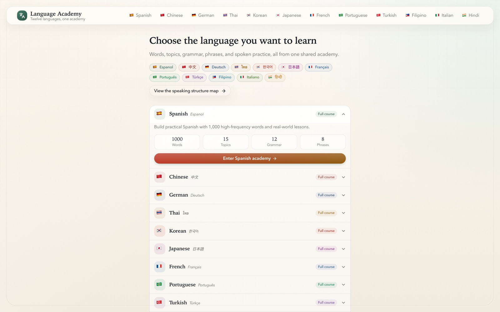
</p>

---

## 🌏 The twelve

🇪🇸 Spanish · 🇨🇳 Chinese · 🇩🇪 German · 🇹🇭 Thai · 🇰🇷 Korean · 🇯🇵 Japanese · 🇫🇷 French ·
🇵🇹 Portuguese · 🇹🇷 Turkish · 🇵🇭 Filipino · 🇮🇹 Italian · 🇮🇳 Hindi

One shared UI shell renders all of them. There are **no per-language route forks** - the bet the
whole codebase is built on is that the same interface generalises, and adding a language is adding
a content folder rather than cloning the app.

| | Every language | Spanish · German · Chinese · Thai |
|---|---|---|
| Topic lessons | **15** | 15 |
| Grammar rules | **12** | 12 |
| Phrase packs | **8** | 8 |
| Slang pack | **✅** | ✅ |
| AI conversation coach | **✅** | ✅ |
| Visual guides + timeline | **✅** | ✅ |
| **Frequency-ranked vocabulary** | *awaiting import* | **1,000 words** |

**180** topic lessons · **144** grammar rules · **96** phrase packs · **12** slang packs ·
**4,000** ranked words · **5,507** content files · **591** prerendered pages.

### The app is honest about the gap

The eight languages without vocabulary do not pretend otherwise. Each one states its own import
status in the interface, with real numbers:

> **Current import status.** French currently has 0 of 1000 words loaded in the unified app. The
> shared structure is ready, so we can keep filling content without touching the UI again.

<p align="center">
  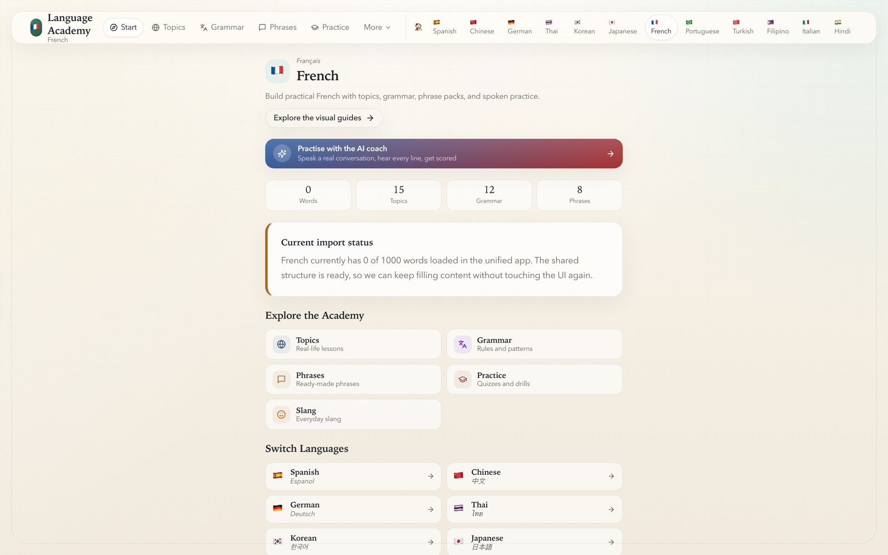
  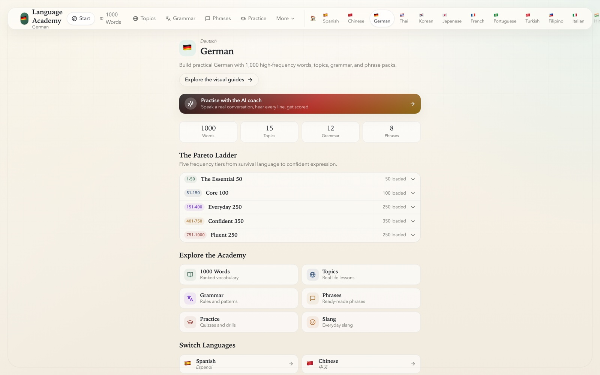
</p>

## 🎯 Frequency first

Most vocabulary apps teach words in the order a textbook chapter needs them. This one orders them
by **how often you will actually meet them**, and commits hard enough to build the navigation
around it. Ranks are contiguous - 1 to 1000, no gaps, no duplicates - grouped into five tiers:

| Tier | Range | The promise |
|---|---|---|
| **The Essential 50** | 1-50 | The words you cannot hold a sentence together without |
| **Core 100** | 51-150 | Enough to be understood, badly |
| **Everyday 250** | 151-400 | Ordinary daily situations |
| **Confident 350** | 401-750 | You stop translating in your head |
| **Fluent 250** | 751-1000 | Nuance, register, opinion |

The framing throughout is **survival → confidence → fluency**, not beginner / intermediate /
advanced. It describes what you can do, not how long you have studied.

<p align="center">
  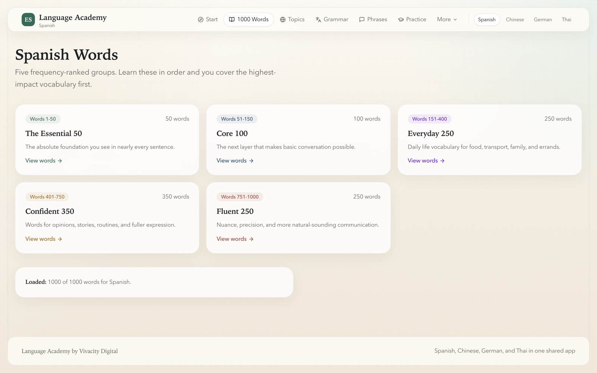
  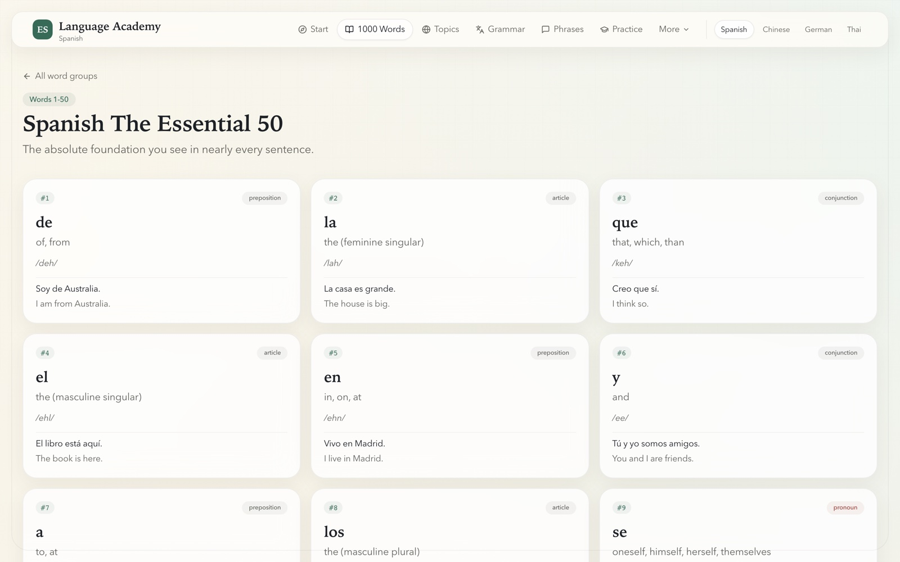
  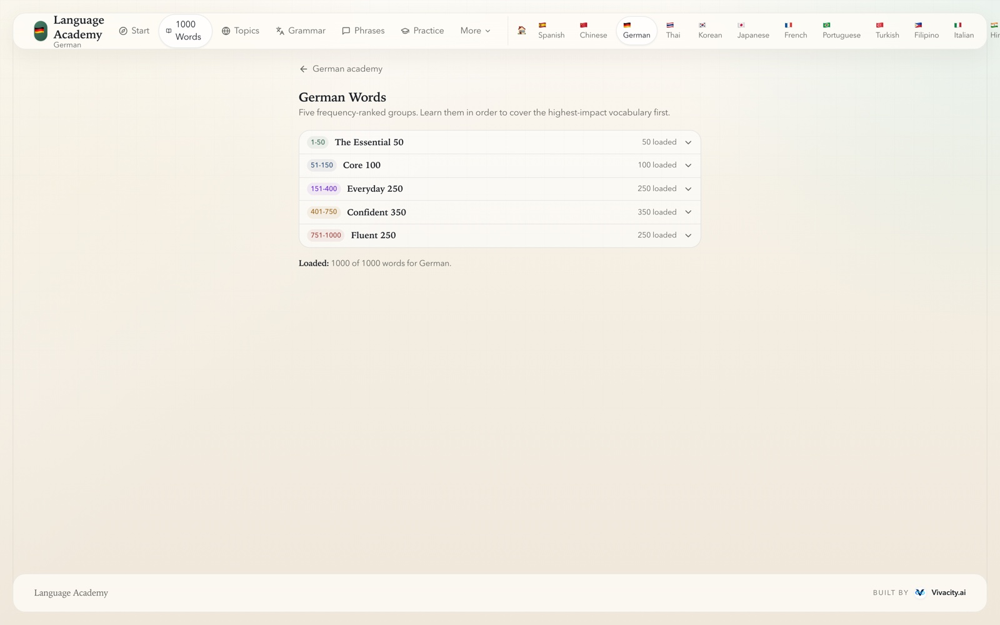
</p>

Each card shows rank, the term (with its article for German), English, pronunciation, a
colour-coded part-of-speech badge across 13 types, gender where it applies, and an example sentence
in both languages.

## 🎙️ Conversation coach

`/{lang}/coach` is guided, scored speaking practice - in **all twelve languages**.

- **With an `ANTHROPIC_API_KEY`** it holds a free-form conversation in your target language.
- **Without one** it replays **real lesson dialogues** from the curriculum. Not an error state and
  not a paywall - a genuinely usable offline mode built from content that already exists.

<p align="center">
  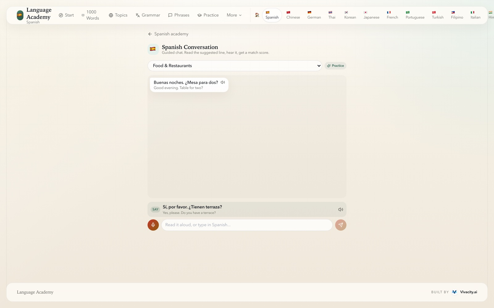
</p>

## 🔊 Real voices, optional

`/api/tts` serves speech through **ElevenLabs** when `ELEVENLABS_API_KEY` is set, including a
**region-matched voice picker** per language. Without a key it falls back to the browser's built-in
Web Speech voices, so pronunciation always works.

**Every key is optional and server-side.** There is not a single `NEXT_PUBLIC_` secret, so nothing
sensitive can reach the browser bundle. [`.env.example`](.env.example) documents exactly what each
key upgrades and what happens without it.

## 🧠 Visual guides: why a sentence is shaped that way

The second proposition, beyond vocabulary. Structure, not drilling:

- **`/{lang}/guides/sentence-skeleton`** - the load-bearing shape of a sentence
- **`/{lang}/guides/phrase-to-pattern`** - turning a memorised phrase into a reusable pattern
- **`/{lang}/guides/meaning-load`** - which words are actually carrying the meaning
- **`/speaking-structure`** - a cross-language map of where speaking pressure sits

<p align="center">
  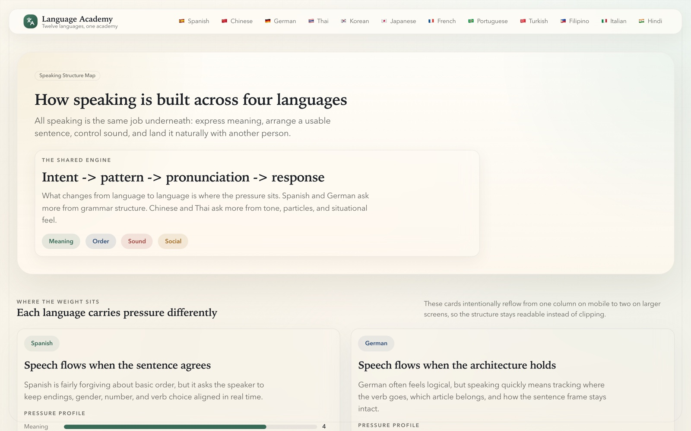
  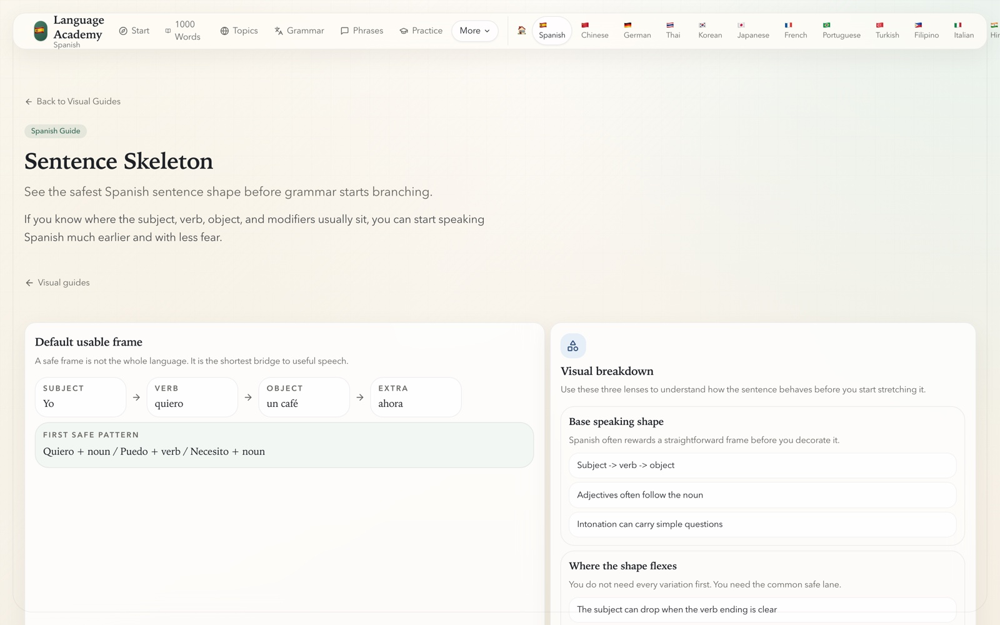
</p>

Plus **`/{lang}/timeline`**, a five-stage learning path, and **`/{lang}/slang`** for the casual
register textbooks skip.

<p align="center">
  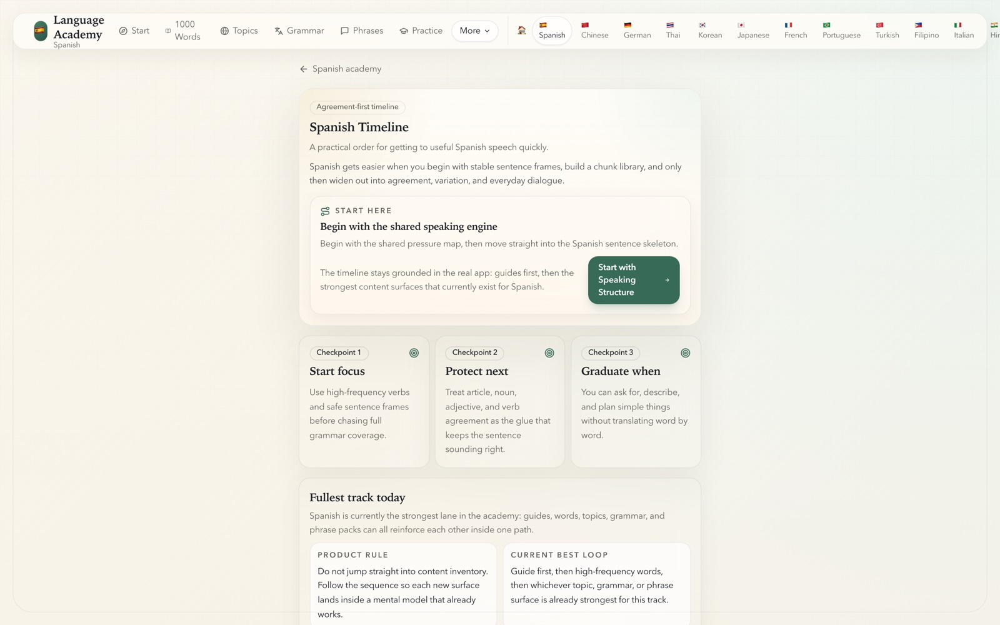
  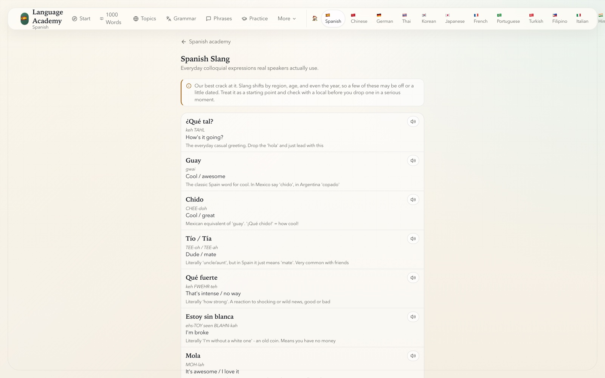
</p>

## 📚 What a topic lesson gives you

**Cultural note → key phrases → grammar callouts (rule, explanation, examples, the common mistake)
→ a dialogue with speaker lines → a quiz.**

<p align="center">
  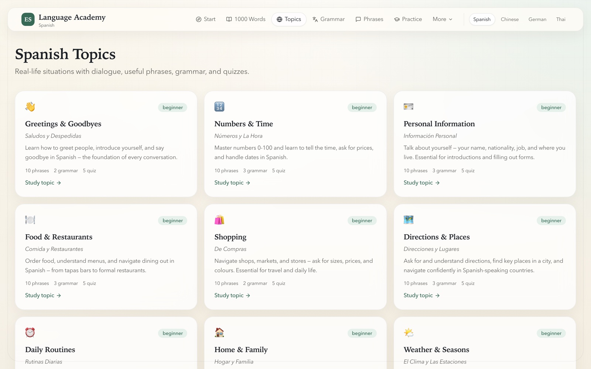
  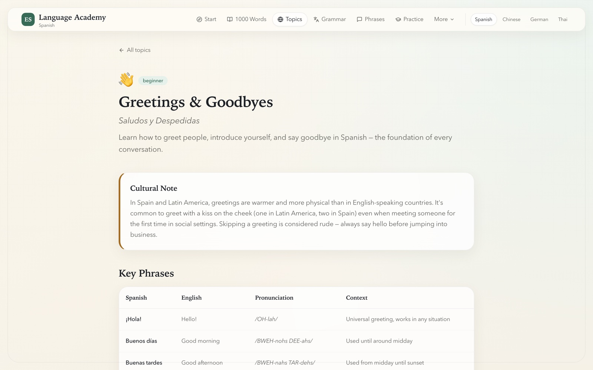
</p>

The quiz supports four question types (`translate`, `fill-blank`, `multiple-choice`, `reorder`),
with immediate feedback and an explanation, one question at a time, and a scored finish.

<p align="center">
  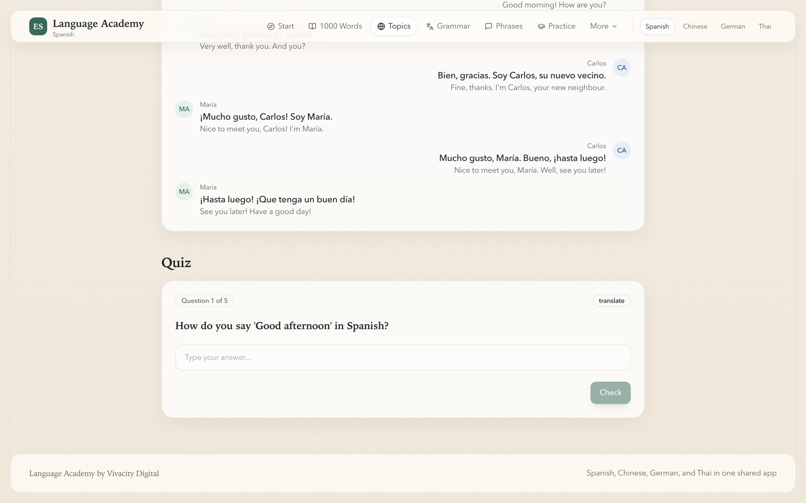
</p>

## 📐 Grammar and phrases

<p align="center">
  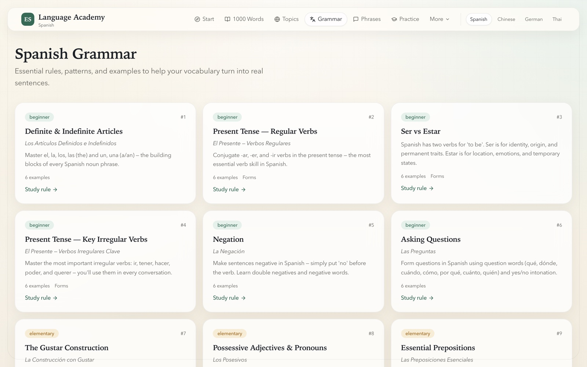
  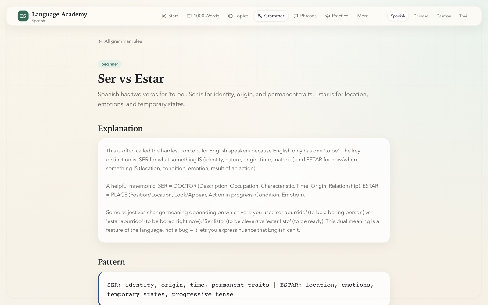
  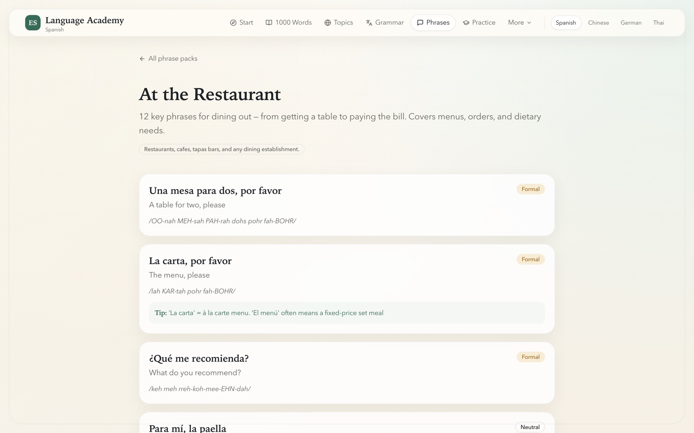
</p>

Grammar rules carry patterns, conjugation tables, examples, common mistakes and tips. Phrase packs
are tagged formal / informal / neutral.

## 🧱 Adding a language is adding a folder

Drop `content/curriculum/{lang}/` in place, add a schema branch, and routing, tiers and navigation
follow. Every content file is validated by **Zod** at load time, so a malformed word file fails the
build rather than shipping a broken card.

The language switcher preserves where you are: switch language from the words section and you land
in the words section, not back at a home page.

## 🛠️ Tech stack

**Next.js 15.1** App Router · **React 19** · **TypeScript 5.7** (strict) · **Tailwind CSS 3.4** ·
**Zod 3.24** for per-language content schemas · **lucide-react** · **Vitest**.

19 routes and 5 API routes (coach, tts, and three voice endpoints). `next.config.js` adds six
permanent redirects mapping legacy unprefixed paths to `/es/*`, plus `X-Content-Type-Options:
nosniff`, `X-Frame-Options: DENY` and `Referrer-Policy: strict-origin-when-cross-origin`. Node >= 20.

```bash
npm run dev          # dev server
npm run build        # production build
npm run test         # vitest run
npm run type-check   # tsc --noEmit
npm run lint         # eslint
```

## ✅ Tests

**3 suites, 12 cases, all passing.** `smoke.test.ts` covers the content loaders across languages,
`visual-guides.test.ts` covers the guide surfaces, and `timeline-plan.test.ts` covers the staged
learning path.

## ⚠️ Honest status

- **Eight of the twelve languages have no vocabulary yet** - French, Japanese, Korean, Portuguese,
  Turkish, Filipino, Italian and Hindi carry lessons, grammar, phrases, slang and the coach, but
  their word ladders are empty. The app states this per language rather than hiding it.
- **There is no CI.** No `.github/` directory, so the suite above only runs locally. Nothing gates
  a push.
- **No spaced repetition and no flashcards.** Word cards are static reference. The quizzes and the
  coach are the active-recall surfaces.
- **No progress persistence.** Nothing is stored between sessions; quiz state resets on reload.
- **Spanish is the most editorially polished track.** Structure is even across all twelve; prose
  passes are not.
- **`content/curriculum/words/` is a dead duplicate** of the Spanish word set (1,000 files kept as
  a legacy fallback the loader no longer reaches). Harmless, but it is dead weight.

## 📄 Licence

No licence file is present, which under GitHub's terms means **all rights reserved** - you may view
this repository, but not reuse it. If you want to build on it, open an issue and ask.

---

<p align="center">
  <em>Language Academy - part of the Vivacity app portfolio.</em><br />
  <a href="https://vdapp41-spanish-academy.vercel.app">Live app</a> ·
  <a href="CLAUDE.md">Architecture notes</a> ·
  <a href="ROADMAP.md">Roadmap</a> ·
  <a href="BACKLOG.md">Backlog</a>
</p>
